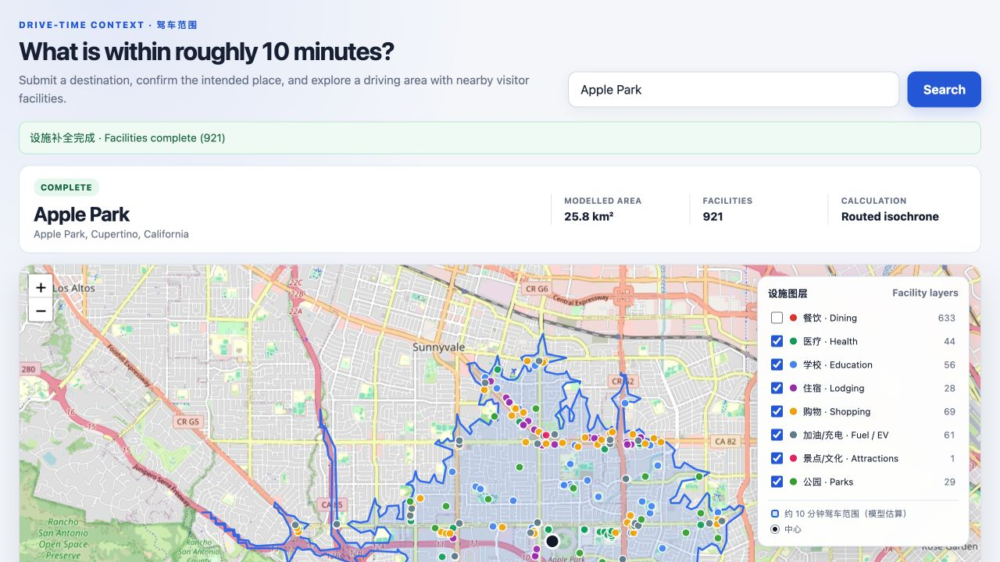
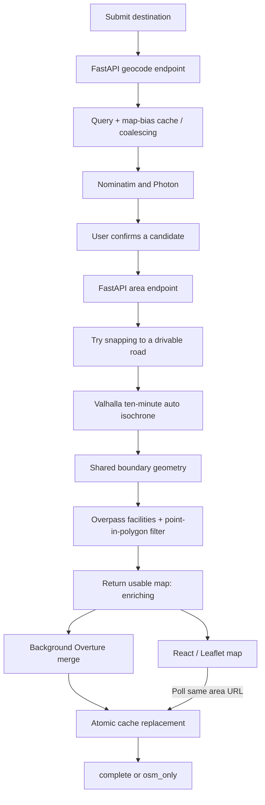

# Nearby 10-Minute Drive Map

[](https://github.com/96528025/nearby-10min-map/actions/workflows/ci.yml)

**A full-stack map that turns a destination into an approximately ten-minute driving area and the visitor facilities inside it.** Users search for a place, confirm the intended result, and explore a road-network boundary with restaurants, hotels, shops, parks, and other facilities.

[Open the demo](https://nearby-10min-map.onrender.com) · [Read the geometry benchmark](reports/accuracy/runs/20260729T082833Z_cfge03df09d_pland796c05b/report.md) · [Architecture decisions](docs/DECISIONS.md)



**Stack:** React 19, TypeScript, React Leaflet, FastAPI, Python, Docker, Render, GitHub Actions, pytest, Vitest, and Playwright.

## Engineering highlights

| Capability | What is implemented | Evidence |
| --- | --- | --- |
| Geospatial correctness | One Polygon/MultiPolygon geometry, including holes, drives both display and facility filtering | [`pipeline.py`](map/server/pipeline.py), [`verify.py`](map/scripts/verify.py), geometry fixtures |
| Progressive results | Return the boundary and OSM facilities first; merge Overture in the background while the browser polls | [`app.py`](map/server/app.py), [`App.tsx`](web/src/App.tsx) |
| Resilient frontend | Typed state transitions, cancellation, stale-response rejection, bounded polling, useful degraded states | [`workflow.ts`](web/src/state/workflow.ts), [`polling.ts`](web/src/state/polling.ts), frontend tests |
| Controlled geocoding | Explicit submit, normalized query/bias cache keys, identical-request coalescing, spaced upstream fetch starts | [`geocode_cache.py`](map/server/geocode_cache.py) |
| Evidence-driven design | A preregistered five-location benchmark rejected the previous equal-area circle | [Plan](reports/accuracy/BENCHMARK_PLAN.md), [recorded run](reports/accuracy/runs/20260729T082833Z_cfge03df09d_pland796c05b/report.md) |
| Delivery | React bundle and Python API in one non-root container; CI checks backend, frontend, and browser workflows | [Dockerfile](Dockerfile), [CI](.github/workflows/ci.yml), [Render configuration](render.yaml) |

The driving boundary is an estimate from Valhalla's free-flow routing model. It does not incorporate live/historical traffic or establish real-world arrival times. The public demo uses a free Render service, so live searches can require a cold start; the committed startup map remains available without computing a new area.

## How a search works



1. **Search and confirm.** The browser geocodes only on submission. Query text is NFKC-normalized, whitespace-collapsed, and case-folded; the cache key also includes map bias. Identical in-flight geocode misses share work, and distinct fetches start at least one second apart. The pipeline queries Nominatim and then Photon and combines usable candidates. The user chooses the destination explicitly.
2. **Compute the boundary.** `/api/area` uses coordinates rounded to four decimals as its file-cache key. On a miss, it tries to locate a suitable public road, including outward probes in 500 m rings up to 2 km. If no suitable snap is available, it keeps the requested point. Valhalla returns an `auto` ten-minute isochrone with `denoise=0.3`.
3. **Return initial facilities.** Overpass supplies named OSM facilities over the full boundary bounding box. Shared geometry predicates filter them into the actual polygon rather than the bounding box. The response contains both geometry and facilities, so display and inclusion use the same boundary.
4. **Enrich asynchronously.** A background thread downloads and merges Overture Places, applies category mapping, a confidence floor of `0.6`, spatial filtering, and heuristic deduplication. The result is written using a temporary file and atomic replacement. Only one enrichment flight per area cache key runs in a given process.
5. **Poll to a terminal state.** The UI keeps the initial map visible while checking the same endpoint. If a process disappeared during enrichment, a later request can restart work from its cached intermediate result.

## Frontend behavior and degraded modes

The reducer has nine states: `idle`, `geocoding`, `candidates`, `empty`, `loadingArea`, `enriching`, `complete`, `osmOnly`, and `error`. Request generations, `AbortController`, and candidate checks prevent an old response from replacing the user's newer selection.

| Situation | User-visible/API behavior |
| --- | --- |
| OSM data ready; Overture still running | `enriching`; initial boundary and facilities remain usable |
| Overture succeeds | `complete`; may contain Overture-only facilities if OSM lookup failed |
| Overture fails or is disabled | `osm_only` with a warning; preserve phase-one results |
| Overpass fails | Preserve boundary; return an empty schema-complete facility collection and coverage warning; enrichment may still succeed |
| Routing/isochrone fails | Labelled `nominal_radius_circle` fallback, normally 3 km around the original requested point |
| Slow first area request | Show a wake-up notice after five seconds; offer retry after a 150-second deadline |
| Enrichment polling fails | Back off from two seconds to a 15-second ceiling; stop after three consecutive failures or five minutes and retain the last good map |

`boundary_mode` and enrichment `status` describe different dimensions: a fallback circle can also be enriched. A completed facility response is not a guarantee that routing succeeded or that all real-world facilities were found. Status text uses an `aria-live` region, and map/data attribution stays visible.

## Why the map uses an isochrone

An earlier version replaced the routed boundary with a circle of equal area. A benchmark compared that approximation against Valhalla's own geometry across five Bay Area locations, using frozen, category-mapped and deduplicated facility datasets.

| Measure for the retired equal-area circle | Result |
| --- | ---: |
| Macro false inclusion: shown facilities outside the reference | 9.1% |
| Macro false exclusion: reference facilities omitted | 24.7% |
| Micro false inclusion / exclusion | 11.0% / 23.7% |
| Preregistered macro limits | At most 10% inclusion / 20% exclusion |
| Decision | Retire the approximation |

Macro averages weight each location equally; micro rates pool facility counts. The result motivated preserving Valhalla's actual Polygon/MultiPolygon, all components and holes, throughout the runtime and bundled-data paths.

The benchmark plan and configuration are hashed into the results, with immutable run directories and a preflight manifest. The run of record completed using 161 cache hits and zero external requests. It is a recorded experiment, not a benchmark rerun on every app deployment.

**Interpretation boundaries:** comparison is against a routing model, not observed driving times. The true isochrone's zero error against itself is definitional. A component/hole parsing defect was found during the work but was not triggered by the five sampled geometries. The same run also records strong origin-snap sensitivity at some locations; those site-specific diagnostics do not establish a general travel-time accuracy claim.

[Benchmark report](reports/accuracy/runs/20260729T082833Z_cfge03df09d_pland796c05b/report.md) · [Boundary decision](docs/DECISIONS.md#d-2--boundary-representation-adopt-the-true-isochrone)

## Bundled first view

The app opens with committed Apple Park data from [`map/data`](map/data): a recorded Valhalla response, its approximately 25.76 km² polygon, 921 facilities across eight categories, and six curated landmarks. The facility snapshot was rebuilt offline from the benchmark's frozen universe and records its provenance. The bundled origin is disclosed as unsnapped; it need not match a new live snapped search.

Startup data is served from `/data/*.json` without geocoding or routing calls. OpenStreetMap raster tiles still require network access.

## Run locally

Prerequisites: Python 3.11 and Node.js 24.15+. Commands start from the repository root.

```bash
python3.11 -m venv .venv
.venv/bin/python -m pip install -r requirements.txt -r requirements-dev.txt
.venv/bin/python -m uvicorn app:app --port 8642 --app-dir map/server
```

In a second terminal:

```bash
cd web
npm ci
npm run dev
```

Open `http://localhost:5173`. Vite proxies `/api` and `/data` to port `8642`. Runtime requirements include FastAPI, Uvicorn, and the Overture CLI; development requirements add pytest and benchmark geometry libraries.

For a production-shaped local run, build the frontend and serve it through FastAPI:

```bash
cd web
npm ci
npm run typecheck
npm run build
cd ..
.venv/bin/python -m uvicorn app:app --port 8642 --app-dir map/server
```

Open `http://localhost:8642`. Alternatively:

```bash
docker build -t nearby-10min-map .
docker run --rm -p 10000:10000 nearby-10min-map
```

The two-stage Dockerfile builds the frontend with Node and runs Python as a non-root user. FastAPI registers `/api` and `/data` before mounting the built app at `/`, keeping production requests on one origin.

## API and configuration

| Endpoint | Inputs | Output/purpose |
| --- | --- | --- |
| `GET /api/geocode` | `q`, optional `bias_lat`, `bias_lon` | Place candidates for user confirmation |
| `GET /api/area` | `lat`, `lon`, optional `name` | Boundary, facilities, total, mode, warnings, enrichment status |
| `GET /api/health` | None | Local liveness only; does not probe upstream availability |
| `GET /data/*.json` | Committed filename | Bundled startup data with revalidation headers |

| Variable | Code default | Purpose |
| --- | --- | --- |
| `ENABLE_OVERTURE` | `true` | Enable background enrichment; otherwise return `osm_only` |
| `OVERTURE_RELEASE` | `2026-08-19.0` | Pinned Places release; update consistently with `render.yaml` |
| `NOMINAL_RADIUS_M` | `3000` | Radius only for the labelled routing fallback |
| `GEOCODE_TIMEOUT_SECONDS` | `15` | Geocoding request timeout |
| `VALHALLA_LOCATE_TIMEOUT_SECONDS` | `5` | Individual road-locate timeout |
| `SNAP_TOTAL_TIMEOUT_SECONDS` | `20` | Road-snap search budget |
| `VALHALLA_ISOCHRONE_TIMEOUT_SECONDS` | `30` | Isochrone request timeout |
| `OVERTURE_PROCESS_TIMEOUT_SECONDS` | `600` | Overture subprocess timeout |

User-agent, Overpass timeouts, and Overture HTTP timeouts are also configurable in the [pipeline](map/server/pipeline.py), its imported scripts, and [Render overrides](render.yaml). The frontend's five-minute polling limit is shorter than the default Overture subprocess limit: stopping UI polling does not cancel the background worker.

## Tests and delivery

The checked-in suites contain **213 pytest cases, 51 Vitest tests, and two Playwright browser scenarios**. Backend tests block real socket creation and use recorded/fake upstream responses; browser scenarios intercept requests. These tests verify deterministic behavior without asserting the availability of live providers.

```bash
.venv/bin/pytest -rs
cd web
npm run typecheck
npm test
npm run build
npx --no-install playwright install chromium
npm run test:e2e
```

Coverage includes multi-component polygons and holes, display/filter agreement, provenance, cache migration and enrichment lifecycle, geocode coalescing/rate limits, deduplication, frontend cancellation/deadlines, and `enriching → complete` / `enriching → osm_only` browser flows.

GitHub Actions runs Python 3.11 and Node 24 jobs on pushes and pull requests. The checked-in Render Blueprint sets `autoDeployTrigger: checksPass`, uses the Dockerfile, and probes `/api/health`.

## Current deployment boundaries

- Caches are JSON files on ephemeral disk with no TTL. They are an optimization, not durable job or user storage.
- Geocode coordination and enrichment single-flight are process-local. Initial `/api/area` computations are not coalesced in this main-branch implementation, and distinct enrichment threads have no global concurrency cap.
- There is no durable queue, authentication, user quota, or multi-instance coordination. Live searches depend on public geocoding, routing, POI, and tile services.
- The map models free-flow reachability; it has no traffic feed, turn-by-turn navigation, reservations, or real-time facility inventory.
- Facility completeness depends on source freshness, category mapping, confidence thresholds, and name/address/distance deduplication heuristics. `complete` describes enrichment completion, not exhaustive coverage.

## Repository guide

| Path | Responsibility |
| --- | --- |
| [`map/server/app.py`](map/server/app.py) | API routes, cache lifecycle, two-phase area work, static serving |
| [`map/server/pipeline.py`](map/server/pipeline.py) | Geocoding, snapping, routing geometry, OSM/Overture facilities |
| [`map/server/geocode_cache.py`](map/server/geocode_cache.py) | Query normalization, file cache, coalescing, fetch rate limit |
| [`map/scripts`](map/scripts) | Shared geometry predicates, category/dedup rules, bundled-data builders |
| [`web/src`](web/src) | React workflow, typed API client, map rendering, accessibility/status UI |
| [`tests`](tests), [`web/e2e`](web/e2e) | Offline backend and browser tests; Vitest tests also live alongside frontend code |
| [`scripts/benchmark_accuracy.py`](scripts/benchmark_accuracy.py), [`reports/accuracy`](reports/accuracy) | Accuracy experiment and recorded evidence |

`docs/CURRENT_STATE_AUDIT.md` and `docs/ATTRIBUTION_AUDIT.md` are historical July 29 audits, not descriptions of every current behavior.

## Data sources and licenses

OpenStreetMap supplies raster tiles and Overpass facilities; Nominatim and Photon provide geocoding; the public Valhalla service supplies road snapping and isochrones; optional Overture Maps/Foursquare-derived Places data enriches facilities. Responses and the UI carry source/processing attribution.

Application code: [MIT](LICENSE). OpenStreetMap data: [ODbL attribution](https://www.openstreetmap.org/copyright). Overture/Foursquare notices and the applicable Apache-2.0 text are included in [NOTICE](NOTICE) and [LICENSES/Apache-2.0.txt](LICENSES/Apache-2.0.txt).
