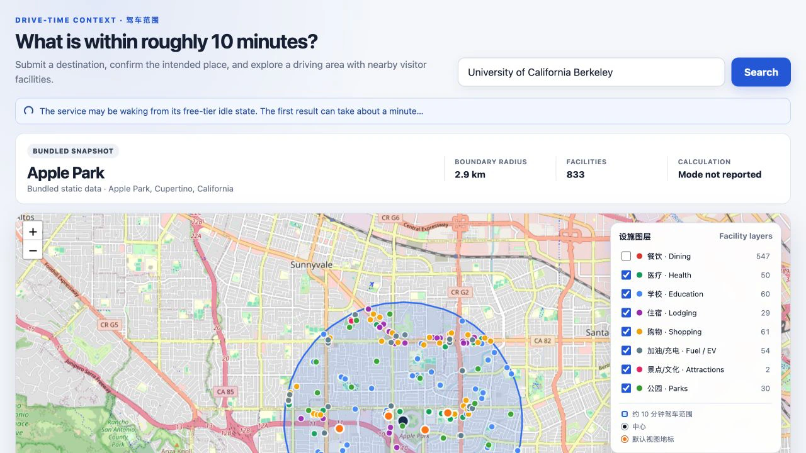
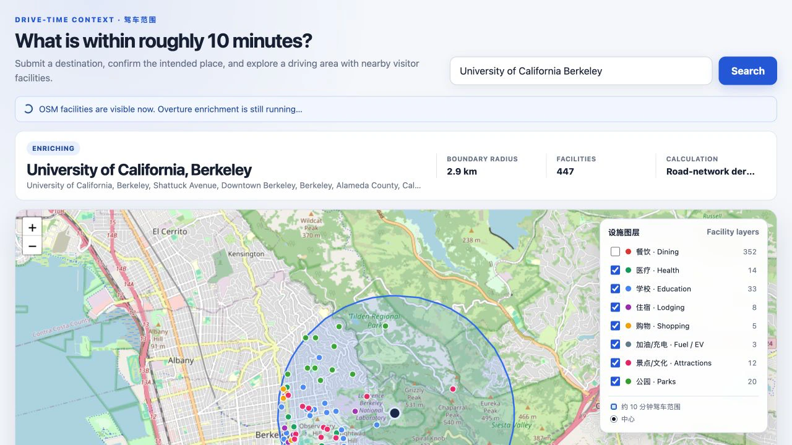

# Nearby 10-Minute Drive Map · 景点周边十分钟车程地图

[](https://github.com/96528025/nearby-10min-map/actions/workflows/ci.yml)

A deployed full-stack geospatial application for understanding the area around
a destination before a trip. Submit a place, confirm the intended geocoding
candidate, and explore visitor-relevant dining, health, education, lodging,
shopping, fuel/EV, culture, and park facilities within an **approximate
10-minute drive**.

This is a driving map, not a walking-radius map. The routed path uses
free-flow road costs and does not include real-time traffic.

**Public app:** [nearby-10min-map.onrender.com](https://nearby-10min-map.onrender.com)

> **Cold-start note:** [Render's free tier](https://render.com/docs/free) may
> take about a minute to wake after 15 minutes without inbound traffic and
> shows a loading page while it starts. One wake-up observed on 2026-08-31
> took 21.9 seconds; that single observation is not an SLA.

## Product walkthrough

| Wake / slow-request notice | Phase-one map available | Enrichment complete |
|---|---|---|
|  |  |  |

The screenshots were taken before the boundary migration described under
"What the boundary means" and still show the retired equal-area circle.

Once the app is served, the bundled Apple Park view loads from `/data/*.json`
without calling a public geocoding, routing, or POI upstream API. A submitted
search then exercises the complete API flow.

## Engineering highlights

- **Typed React workflow:** React 19, TypeScript, React Leaflet, and a strict
  discriminated-union state machine cover every success, empty, degraded, and
  error terminal state.
- **Race-safe asynchronous UI:** `AbortController`, request generations,
  component cleanup, bounded exponential-backoff polling, and retryable
  deadlines prevent stale searches and polls from overwriting newer results.
- **Resilient two-phase API:** FastAPI returns a usable OSM map first, then
  enriches it with Overture Places in a background single-flight operation.
- **Honest geospatial provenance:** the API explicitly distinguishes the
  routed Valhalla isochrone (rendered as returned) from a fixed nominal-radius
  fallback. The UI never infers provenance from the geometry's shape; the
  bundled snapshot declares its own `boundary_mode`.
- **Public-service safeguards:** submitted searches only, aggregate Nominatim
  rate limiting, cache-before-limit lookup, request coalescing, identifiable
  backend `User-Agent`, bounded upstream calls, and no tile prefetching.
- **Deployable as one service:** a multi-stage Docker image builds the Vite
  frontend with Node 24 and serves it with the Python 3.11 API on Render.

## Architecture

```text
Browser
├── React + TypeScript + react-leaflet
│   ├── /data/...  bundled Apple Park snapshot
│   ├── /api/...   same-origin application API
│   └── OSM raster tiles with visible attribution
│
└── FastAPI
    ├── /api/health     local liveness only; no upstream call
    ├── /api/geocode    cache → single-flight → 1 req/s limiter
    │                    → Photon + Nominatim
    ├── /api/area       four-decimal file-cache key
    │   ├── phase 1     attempted road snap → Valhalla isochrone (rendered as
    │   │               returned) → OSM Overpass facilities filtered with it
    │   └── phase 2     background Overture merge → verify → atomic cache write
    ├── /data           committed static snapshot
    └── /               web/dist HTML catch-all, mounted last
```

The cache under `map/cache/` is an optimization, not durable application
state. API and `/data` routes are registered before the frontend catch-all.
Local Vite development preserves the same absolute `/api/...` and `/data/...`
paths through a proxy, so production needs neither a hard-coded backend host
nor CORS.

## Request and state lifecycle

The browser only geocodes after an explicit form submission; there is no
autocomplete or search-on-keystroke behavior.

```text
idle
└── explicit submit → geocoding
    ├── candidates
    │   └── selection → loadingArea
    │       ├── enriching
    │       │   ├── complete
    │       │   ├── osmOnly
    │       │   └── error
    │       ├── complete
    │       ├── osmOnly
    │       └── error
    ├── empty
    └── error
```

`/api/area` exposes the backend values `enriching`, `complete`, and
`osm_only`; the frontend maps the last value to its distinct `osmOnly` state.
It is not presented as full success or total failure:

- `enriching`: phase-one boundary and OSM data are already usable; the client
  polls the same URL with backoff.
- `complete`: optional Overture enrichment finished and the merged result is
  available.
- `osm_only`: map data remains usable, but enrichment either failed or was
  disabled. Configuration-off results say so explicitly and do not claim an
  upstream failure.

If both configured Overpass endpoints are unavailable, phase one returns a
schema-complete empty OSM collection plus a visible coverage warning. Overture
may still populate the final result.

## What the boundary means

The normal result is the routed isochrone itself:

1. The API attempts to snap the selected point to a drivable public road. If
   Valhalla locate is unavailable or finds no suitable road, it retains the
   user-selected coordinates for the routed isochrone request.
2. Valhalla computes a ten-minute `auto` isochrone under free-flow costs.
3. The API returns that geometry as returned — every `Polygon` /
   `MultiPolygon` component and every interior hole — as the displayed
   boundary: `boundary_mode="routed_isochrone"`. The same geometry object
   filters OSM facilities, filters the Overture merge, and is re-checked by
   the consistency guard; the upstream POI queries use its full bounding box.

Both bundled and live isochrone requests use Valhalla `denoise=0.3`.
"As returned" therefore means the complete geometry in Valhalla's
post-denoise response, not every smaller reachable fragment that Valhalla may
remove before returning that response.

The isochrone is a **model estimate** of the free-flow, approximately
ten-minute driving range from posted speed limits, with no live or historical
traffic. Until this migration the API displayed an equal-area circle derived
from the isochrone; the preregistered benchmark
(`reports/accuracy/BENCHMARK_PLAN.md`, run
`20260729T082833Z_cfge03df09d_pland796c05b`) measured that circle at 9.1 %
macro false inclusion and 24.7 % macro false exclusion against Valhalla's own
geometry, failing its frozen acceptance rule, so the circle approximation was
retired on both the bundled and the live path (`docs/DECISIONS.md`, D-2).
Rendering the isochrone removes that model-internal approximation layer. It
does not validate real-world drive time, which would need GPS traces,
historical traffic data or field sampling that this project does not have.

If Valhalla is unavailable, the API uses a fixed radius with no road-network
input, `boundary_mode="nominal_radius_circle"`, and returns a user-displayable
warning; only this fallback reports a radius. Facility-filter provenance
changes with the boundary mode instead of claiming that a nominal circle came
from routing.

Point-in-polygon checks confirm that the returned facilities satisfy the same
boundary predicate used to filter them. They do **not** independently validate
facility quality or real-world drive time. The repository's benchmark uses a
Valhalla isochrone as its reference and is likewise a model-consistency study,
not field validation.

## Technology

| Layer | Tools |
|---|---|
| Frontend | React 19, TypeScript, Vite, React Leaflet, Leaflet vector layers |
| Backend | Python 3.11, FastAPI, Uvicorn, background threads, atomic JSON file cache |
| Public data | OpenStreetMap tiles and Overpass, Valhalla, Photon, Nominatim, Overture Places |
| Testing | pytest, Vitest, React Testing Library, Playwright with intercepted API fixtures |
| Delivery | GitHub Actions, multi-stage Docker, Render Blueprint |

No database, authentication layer, client state-management library, or
API-key map provider is required for this project scope.

## Run locally

Prerequisites: Python 3.11 and Node.js 24.

Start the API in one terminal:

```bash
python3 -m venv .venv
.venv/bin/pip install -r requirements.txt -r requirements-dev.txt
.venv/bin/uvicorn app:app --port 8642 --app-dir map/server
```

Start Vite in another terminal:

```bash
cd web
npm ci
npm run dev
```

Open `http://localhost:5173`. Vite proxies `/api` and `/data` to port 8642.
For the production-shaped single-service path, build first and open port 8642:

```bash
cd web
npm ci
npm run typecheck
npm run build
cd ..
.venv/bin/uvicorn app:app --port 8642 --app-dir map/server
```

The React application in `web/` is the only production frontend. The previous
single-file Leaflet implementation was removed because neither the FastAPI
production mount nor the Docker image used it; it remains available through
Git history with `git log --all -- map/index.html`.

## Tests and CI

```bash
.venv/bin/pytest -rs

cd web
npm run typecheck
npm test
npm run build
npm run test:e2e
```

The Python suite is offline and blocks socket access. Vitest and React Testing
Library cover the state machine, every terminal UI state, timeouts, retries,
request cancellation, unmount cleanup, and stale-response races. Playwright
intercepts `/api/geocode` and `/api/area` for both
`enriching → complete` and `enriching → osm_only`; CI never depends on a public
upstream's availability or usage allowance. Five small, provenance-bearing
Valhalla response fixtures replay the benchmark locations in clean CI, while a
Shapely cross-check independently verifies the production boundary predicate
over all 12,600 frozen Apple Park POI candidates. These are dataset-consistency
checks, not claims about real-world drive time or POI quality.

GitHub Actions runs Python 3.11 tests plus the Node 24 typecheck, component
tests, production build, and browser tests. Render's Blueprint uses
`autoDeployTrigger: checksPass`, so a commit is deployed only after those
checks pass.

## Public deployment

[`render.yaml`](render.yaml) defines one free Docker Web Service.
[`Dockerfile`](Dockerfile) builds `web/dist` in a Node stage, installs the
Python runtime separately, retains required attribution files, runs as a
non-root user, and starts Uvicorn on `0.0.0.0:$PORT`. The health check is
`/api/health`, which performs no network work.

`ENABLE_OVERTURE` makes the memory-heavy second phase configurable. It is
enabled for the current deployment; if the 512 MB free instance cannot sustain
it, setting the variable to `false` produces an explicit, usable `osm_only`
result. The production Overture release is pinned to `2026-08-19.0`.

## Known limitations and observed variability

- **Free-instance sleep and cold start:** Render can spin down the service
  after 15 minutes without inbound traffic. One wake-up observed on
  2026-08-31 took **21.894 seconds**. That is a one-time observation, not an
  availability or latency SLA; later starts can be faster or slower.
- **Ephemeral cache:** the free service has no persistent disk. Cached
  geocodes, phase-one areas, and enriched results can disappear after sleep,
  restart, or redeploy. Correctness cannot depend on those files. If a process
  disappears while a cached result says `enriching`, the next request resumes
  phase two instead of leaving it stuck forever.
- **Public upstreams have no SLA:** Photon, Nominatim, Valhalla, Overpass, and
  the Overture public bucket can be slow, rate-limited, unavailable, or updated
  independently. Timeouts, fallback paths, and warnings make these failures
  visible but cannot create an availability guarantee.
- **Facility counts are not stable metrics:** two Stanford University queries
  observed on 2026-08-31 completed with **1,095** and **1,304** facilities.
  Overpass was unavailable during the 1,095-result run. Counts vary with
  upstream availability, source updates, confidence filtering, and deduplication;
  neither number is a promised inventory.
- **Pinned Overture releases expire:** `overturemaps` downloads a named release
  from a public bucket that rotates out older releases. The default in
  `map/server/pipeline.py` and the production value in `render.yaml` should be
  updated together so local and deployed behavior remain reproducible. If the
  release that is actually in use disappears or becomes unavailable,
  enrichment can end as `osm_only` or remain incomplete.
- **The boundary is a model estimate:** the routed mode displays Valhalla's
  free-flow isochrone as returned. That removes the former circle
  approximation but does not make the ten-minute range a measured quantity;
  road snapping alone can change the modelled area several-fold at some
  destinations (`docs/DECISIONS.md`, D-6). The nominal mode is a fixed-radius
  fallback with no road-network input and must always remain visibly labeled.
- **No traffic model:** Valhalla uses free-flow costs; rush hour, closures,
  weather, parking, and time spent leaving a campus or airport are absent.
- **Facility quality is not independently verified:** the committed Apple Park
  snapshot contains 921 facilities, but the repository has no record of manual
  review for all 921. Its six-landmark check only verifies containment.
- **Demo-scale service:** unauthenticated public endpoints and community
  upstreams are suitable for a portfolio deployment, not high-volume
  commercial traffic. A production service would use owned or contracted
  routing, geocoding, POI, and tile infrastructure.

## Evidence and audit trail

This repository keeps limitations next to evidence rather than turning old
measurements into permanent product claims:

- [`docs/CURRENT_STATE_AUDIT.md`](docs/CURRENT_STATE_AUDIT.md) is the dated,
  point-in-time audit of the pre-upgrade application. Its legacy frontend line
  references remain reproducible through Git history.
- [`docs/DECISIONS.md`](docs/DECISIONS.md) records architecture and geometry
  tradeoffs, including what evidence would change a decision.
- [`reports/accuracy/BENCHMARK_PLAN.md`](reports/accuracy/BENCHMARK_PLAN.md) and
  immutable run directories preserve the preregistered model benchmark.
- [`docs/ATTRIBUTION_AUDIT.md`](docs/ATTRIBUTION_AUDIT.md) records OSM,
  Overture, and Foursquare attribution findings and remediation.

The committed Apple Park snapshot contains 921 facilities across the eight
categories (`633/44/56/28/69/61/1/29`). It is rebuilt offline by
`map/scripts/facilities_from_frozen_universe.py` from the benchmark run of
record's frozen POI universe (Overture release `2026-07-22.0`, Overpass query
hash and dedup rules recorded in `facilities.json.metadata.provenance`),
filtered with the same boundary predicate the live API uses. The earlier
snapshot was fetched over the retired circle's bounding box, which the true
isochrone extends beyond by up to about 3.9 km, so it could not simply be
re-filtered. Compared with the pre-migration snapshot at commit `2b9289f`, 70
previously displayed records that fall inside the new boundary have no exact
`(category, name)` match in the regenerated snapshot. This is a label-level
reconciliation, not a count of physical facilities removed: the committed
artifacts do not classify how many reflect source-version drift, renaming,
deduplication, or an actual disappearance. The frozen universe stores no OSM
tags; `kind`, `addr` and the OSM id were carried over from the earlier snapshot
where the same named place lies within 150 m and are otherwise null. The
bundled boundary itself is the recorded `map/data/isochrone.json` (unsnapped
ring-building origin, 2026-07-12), written through the live
`pipeline.boundary_from_isochrone` by `map/scripts/make_boundary.py`.

## Data sources, policies, and license

| Source | Use | Operational or license note |
|---|---|---|
| [OpenStreetMap](https://www.openstreetmap.org/copyright) | Raster map and Overpass POIs | ODbL; visible attribution retained |
| [Valhalla public server](https://gis-ops.com/global-open-valhalla-server-online/) | Road snap and isochrone | Community service; no SLA |
| [Photon](https://photon.komoot.io) and [Nominatim](https://nominatim.org) | Geocoding candidates | Explicit-submit search; backend caching and rate limiting |
| [Overture Maps](https://overturemaps.org) | Optional facility enrichment | Modified Places data; release and transformation provenance retained |

The browser uses the official OSM raster URL, visible attribution, ordinary
Referer and browser caching behavior, and no prefetch or bulk download. A
commercial deployment should replace community endpoints with infrastructure
that provides an appropriate SLA and usage agreement.

Code is available under the [`MIT License`](LICENSE). Map data is ©
OpenStreetMap contributors under ODbL. POI results can include modified
Overture Maps Foundation and Foursquare Places data. Required notices and the
Apache-2.0 text are retained in
[`NOTICE`](NOTICE) and
[`LICENSES/Apache-2.0.txt`](LICENSES/Apache-2.0.txt).
